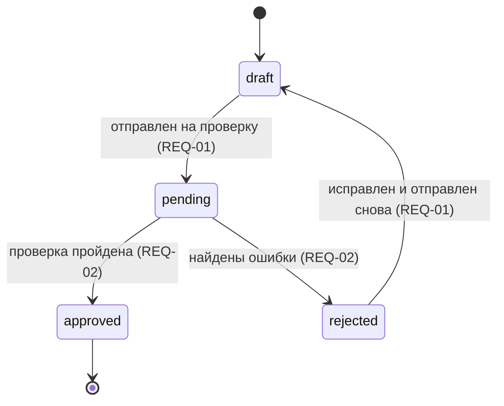

# tl-spec Document Template

The canonical shape of a requirements spec. It is read by humans (product, analysts, developers) and by other skills (`tl-tech-design --spec`, `tl-plan --spec`), so the AI-native skeleton — frontmatter keys, `REQ-NN` ids, machine-readable markers — stays stable.

The file lives at `docs/specs/<YYYY-MM-DD>-<slug>.md` — a **flat file**, not a folder. `init` mode produces the first version; `update` mode (`--update <path>`) amends it in place. A spec answers **WHAT** the system must do: no solution variants or architecture (that is `tl-tech-design`), no task breakdown (that is `tl-plan`).

Russian section labels and markers are user-facing literals — keep them in Russian.

## Contents

- [YAML frontmatter](#yaml-frontmatter) — the seven mandatory keys
- [Sections](#sections--core-and-conditional) — core and conditional
- [Skeleton](#skeleton) — the shape to write
- [Section rules](#section-rules) — what each section must contain, plus the ceiling on open questions
- [Conformance checklist](#conformance-checklist) — run before writing

---

## YAML frontmatter

The document starts with a YAML block. All seven keys are mandatory and **always present**; values may be `[]` / `null` until the matching workflow step fills them in. Omitting a key is a bug — downstream tooling relies on the fixed shape.

```yaml
---
slug: <kebab-case-slug>     # kebab-case, ASCII, ≤50 chars. Matches the filename suffix.
status: draft               # draft | clarifying | ready | superseded
created: <YYYY-MM-DD>       # ISO date, set once; never changes afterwards.
updated: <YYYY-MM-DD>       # ISO date of the last edit; equals `created` on the first write.
sources: []                 # paths / links the requirements came from (Jira, Confluence, `/tl-research` artifacts).
tags: []                    # domain / area tags, free-form.
superseded_by: null         # path to the spec that replaced this one, or null.
---
```

**`status` lifecycle.** `draft` — the document exists but no clarification round has run. `clarifying` — at least one **blocking** unknown is still open; the spec is not safe to plan from. `ready` — see the gate below. `superseded` — replaced by another spec, and `superseded_by` MUST hold a non-empty path.

**The `ready` gate — two independent rules, and both must hold:**

1. **Zero blocking open questions.** No `- [ ] open:` item may remain whose answer would change scope, acceptance criteria or a «Текущее состояние» value. A non-blocking question nobody intends to chase is re-marked `- [-] parked:` before the flip — `ready` never coexists with a live `open`.
2. **Zero unresolved conflicts.** Every requirement carrying `**Текущее состояние:** конфликт` has a matching `- [x] answered:` item in `## Открытые вопросы`. An unresolved conflict blocks `ready` even when no open question is left dangling.

---

## Sections — core and conditional

The document scales with its own size instead of padding a three-requirement spec with «nothing here» lines.

**Core — always present, in this order:** `# <Название спеки>`, `## Проблема и контекст`, `## Scope`, `## Non-goals`, `## Требования`, `## Открытые вопросы`.

**Conditional — the heading appears only when the section has content:** `## Термины`, one diagram section — `## Жизненный цикл` **or** `## Основной сценарий`, never both — `## Допущения`, `## Источники`, and `## Расхождения с текущей реализацией`. The last one appears from **4 requirements** up; below that the per-requirement `**Текущее состояние:**` lines already are the table, and repeating them is a derived view that goes stale. The diagram section is not gated on a count at all — it has its own two triggers, see «Диаграмма» below. Present conditional sections keep their place in the order of the skeleton below.

**A section that is present is never empty.** A heading with nothing under it is indistinguishable from «забыли заполнить»: either the section carries content, or it is not emitted at all. One exception — `## Открытые вопросы` is core because the `ready` gate depends on it, so with no questions it carries the single bullet `- Открытых вопросов нет.`

---

## Skeleton

````markdown
# <Название спеки>

## Проблема и контекст

<1–3 абзаца: чья это боль, что сейчас не работает, откуда пришла задача,
какие внешние сроки или ограничения на неё влияют.>

## Scope

- <что входит в эту спеку>

## Non-goals

- <что эта спека явно НЕ покрывает>

## Термины

- **<термин>** — <определение в контексте этой спеки>.

## Жизненный цикл

<Одна из двух диаграммных секций — эта или `## Основной сценарий`, не обе, и внутри
ровно одна диаграмма. Триггеры и правила — «Диаграмма» ниже; не сработал ни один —
секции в документе нет.>



## Требования

### REQ-01: <короткое имя>

Когда <триггер>, система ДОЛЖНА <наблюдаемое поведение>.

Приоритет: must

**Acceptance criteria.**
- Given <исходное состояние>, When <действие>, Then <проверяемый результат>.

**Текущее состояние:** частично — `src/import/parser.ts:118`

### REQ-02: <короткое имя>

Когда <триггер>, система ДОЛЖНА <наблюдаемое поведение>.

Приоритет: should

**Acceptance criteria.**
- Given <…>, When <…>, Then <…>.

**Текущее состояние:** нет
Искали: `grep -rn "retry" src/import/`, `glob src/**/*retry*`, читал `src/import/runner.ts`

## Расхождения с текущей реализацией

| REQ ID | Состояние | Где в коде | Что нужно |
|---|---|---|---|
| REQ-01 | частично | `src/import/parser.ts:118` | <что дописать или изменить> |
| REQ-02 | нет | — | <что создать с нуля> |

## Допущения

- [assumed] <что приняли за дефолт> — основание: <почему именно так>; влияет на: REQ-01, REQ-02

## Открытые вопросы

<при status: clarifying или ready — не более трёх `- [ ] open:`; остальные закрыты
допущением в `## Допущения` или помечены `- [-] parked:`>

- [ ] open: <вопрос> — предлагаю: <решение>; нужно решение: <кто>
- [x] answered: <вопрос> — <ответ + кто/где>
- [-] parked: <вопрос> — <почему отложили>

## Источники

- <ссылка или путь> — <что именно оттуда взято>
- <ссылка или путь> — <что взято>; устарело: <что именно> — в коде `path/to/file.ext:12`
````

---

## Section rules

**`## Scope` / `## Non-goals`** — both mandatory, at least one bullet each. `Non-goals` is load-bearing scope control; «пока не знаем» is not a Non-goal, it belongs in `## Открытые вопросы`.

**`## Требования`** — at least one `REQ-NN` block, each with, in this order:

1. **Heading** `### REQ-NN: <короткое имя>`. `NN` is zero-padded, starts at `01`, assigned once, **never renumbered and never reused** — `/tl-tech-design --spec` and `/tl-plan --spec` reference them, and a retired id stays retired.
2. **Statement** — one EARS-like sentence `Когда <триггер>, система ДОЛЖНА <поведение>.` One requirement per block; an «и» joining two independent behaviours means two requirements.
3. **Priority** — a single line `Приоритет: must | should | could`.
4. **Acceptance criteria** — a `**Acceptance criteria.**` bullet list in Given/When/Then form, every criterion checkable by a human or a test («работает корректно» is not a criterion).
5. **Current state** — a single line `**Текущее состояние:** нет | частично | есть | конфликт` with the evidence below.

**Evidence for «Текущее состояние»** — this is what makes the field falsifiable. `частично` / `есть` / `конфликт` each require a concrete citation `path/to/file.ext:123`; `нет` requires a following line `Искали: <grep/glob queries and paths that were actually run>`. A citation is a real file path plus a real line number — «где-то в модуле X» and a line number that does not exist are both invalid, and `нет` without an `Искали:` line means «не смотрели», not «не нашли».

**`## Расхождения с текущей реализацией`** (from 4 requirements up) — four columns `REQ ID | Состояние | Где в коде | Что нужно`, one row per requirement in `REQ-NN` order. `Состояние` and `Где в коде` repeat the requirement block; `Что нужно` is one short phrase about the delta. It is a summary, not a second source of truth: **if it disagrees with a requirement block, the block wins** and the table is fixed.

**Диаграмма — `## Жизненный цикл` или `## Основной сценарий`.** A spec answers WHAT, and a picture of boxes and arrows is usually HOW: an architecture, component or deployment diagram belongs to `tl-tech-design` and never appears here. Two shapes stay on the WHAT side, and the section is emitted only when one of them has an actual trigger:

| Heading | Diagram | Trigger |
|---|---|---|
| `## Жизненный цикл` | `stateDiagram-v2` | **≥2 requirements** constrain transitions between named states of one entity — статусы заявки, акта, импорта |
| `## Основной сценарий` | `sequenceDiagram` or `flowchart` | one end-to-end scenario spans **≥3 participants** (пользователь, сервис, внешняя система) **and** the order of the steps is itself a requirement |

**At most one diagram section, with exactly one diagram in it.** No trigger fires → no section, whatever the size of the spec: a set of flat, independent requirements is a list, and drawing a list as a graph adds nothing. Both trigger → keep the one that covers more `REQ-NN` ids and drop the other.

**In `## Основной сценарий` the nodes are participants and the steps they take** — «менеджер», «отправил файл», «система приняла» — never services, modules, queues, tables or storages. `flowchart` is also the notation an architecture diagram is drawn in, so this is the one place where the WHAT/HOW line is crossed by accident: the moment a box is named after a component instead of an actor or an action, the picture has stopped being a requirement and become a design, and a design belongs to `tl-tech-design`. The same test in one question — could this box appear in a Given/When/Then criterion? If not, it does not belong here.

**HARD RULE — every state, transition and step traces to a `REQ-NN`, and the id is written on the element itself**: `pending --> approved: проверка пройдена (REQ-02)`. This is what stops the section from becoming the one place where behaviour arrives without an id, a priority and acceptance criteria. An element no requirement covers is not a diagram drawn too finely — it is a requirement that is missing: write the `REQ-NN` block, or remove the element. Structural nodes that carry no behaviour (`[*]`, a terminal state, a participant declaration) need no id.

Drawing the picture is usually what surfaces the hole in the first place — an entity with no way out of `rejected`, a step nobody owns, a branch that never returns — because a list of requirements hides exactly what a graph makes obvious. Close it the way every other late unknown is closed, not by drawing the arrow and moving on: a justified default → the requirement written in full plus a `- [assumed] …` item in `## Допущения`; no default and blocking → `TBD` in the requirement plus a `- [ ] open:` carrying its `предлагаю:`. The clarification session cap still holds — a hole found late does not buy extra questions.

**The diagram is a derived view, exactly like `## Расхождения`: if it disagrees with a requirement block, the block wins** and the diagram is fixed. It is drawn after the requirements are settled and re-read whenever one of them changes — a lifecycle left over from an earlier draft is worse than no lifecycle at all, because a reader takes it for agreed behaviour.

**Mermaid only, never ASCII art** — GitLab, GitHub, VS Code and Obsidian render `mermaid` fences natively. **Do not use the C4 syntax** (`C4Context` and friends): it is experimental and GitHub's bundled mermaid does not render it.

**`## Допущения`** — decisions the agent made **on the user's behalf** (the answers to «не знаю» / «решай сам»), one per line:

```
- [assumed] <что приняли за дефолт> — основание: <почему именно так>; влияет на: REQ-NN[, REQ-MM]
```

**HARD RULE.** An assumption is **never** silently baked into the wording of a requirement. It is always visible as a separate item here with the affected `REQ-NN` ids, so a reader can review every delegated decision by scanning one list. If a default only exists inside a requirement sentence, the spec is broken.

**`## Открытые вопросы`** — three markers: `- [ ] open: <вопрос> — предлагаю: <решение>; нужно решение: <кто>` still hanging, `- [x] answered: <вопрос> — <ответ + кто/где>` resolved with the answer inline, `- [-] parked: <вопрос> — <почему отложили>` deliberately deferred.

**HARD RULE — an `open` item always carries a proposed resolution.** `предлагаю:` is the resolution the agent would take if it had to decide alone, and `нужно решение:` names the person or role who actually decides. An item without them hands the reader a problem instead of a choice — and it is exactly what a reader without the repository in front of them cannot fill in. A proposal is not an assumption: it changes nothing in the requirement text and never appears in `## Допущения`. `parked` and `answered` items need no proposal — one is deferred on purpose, the other is decided.

**HARD RULE — не более трёх `- [ ] open:` in a document with `status: clarifying` or `status: ready`.** A `draft` is exempt: it is a work surface and may carry any number of them. At `ready` the gate above is stricter still — zero — so in practice this ceiling binds `clarifying`. Above three, the section stops being a decision list and becomes a backlog nobody works through — the reader skims it and plans anyway, which is the exact failure the `open` marker exists to prevent.

**Which three survive**, in this order of precedence — everything else is closed:

1. The answer changes **scope**: a requirement appears, disappears or splits depending on it.
2. The answer changes **safety** — security, data loss, money, privacy, or a compliance obligation.
3. The answer changes the **user-facing scenario**: what the person using the system sees or does.

Everything below that bar leaves the section by one of two doors, and never by deletion:

- **Into `## Допущения`** — the agent takes its own `предлагаю:` as the default and writes `- [assumed] <что приняли> — основание: <почему>; влияет на: REQ-NN`. This is the default door: the proposal was already the resolution the agent would take, so promoting it costs nothing but the honesty of saying so out loud.
- **Marked `- [-] parked: <вопрос> — <почему отложили>`** — for a question nobody intends to chase in this round, where inventing a default would be worse than leaving the gap visible.

The count is over live `- [ ] open:` items only: `answered` and `parked` items are history and are never trimmed to fit. When more than three clear the bar, keep the three highest by the precedence above and park the rest with «упирается в те же три» as the reason — a spec that genuinely needs a fourth blocking answer is a spec whose scope was never narrowed.

**`## Термины`** — `**термин** — определение` lines for domain nouns used as if everyone agreed on their meaning. **`## Источники`** — tickets, wiki pages, research artifacts, chat decisions, mirroring the frontmatter `sources` with a note on what was taken from where. When the input-reconciliation step found a source describing the system as it no longer is, the same line says so — `устарело: <что именно> — в коде path/to/file.ext:12` — so the next reader does not re-derive the requirements from a stale page.

---

## Conformance checklist

Run before writing. The document MUST have: the frontmatter with all seven keys; a single `# <Название спеки>`; the six core sections in order; every conditional section it emits carrying real content; ≥1 bullet in `## Scope` and in `## Non-goals`; ≥1 `### REQ-NN` block with statement, `Приоритет:`, Given/When/Then criteria and `**Текущее состояние:**`; and, from 4 requirements up, `## Расхождения с текущей реализацией` with one row per requirement.

The document MUST NOT:

- Contain a heading with nothing under it, or a `- [assumed] …` / term / source list dressed up as a placeholder instead of being omitted.
- Contain inline keys like `Priority:` / `Owner:` / `Status:` outside the frontmatter — metadata belongs in the frontmatter, behaviour in a requirement block.
- Renumber or reuse `REQ-NN` ids.
- Carry `status: ready` while a `- [ ] open:` item is present, or while a `**Текущее состояние:** конфликт` has no matching `- [x] answered:` item.
- Carry a «Текущее состояние» other than `нет` without a concrete `path/to/file.ext:123` citation, or `нет` without a following `Искали:` line.
- Contain a `- [ ] open:` item without its `предлагаю: <решение>` proposal and a `нужно решение: <кто>` decider.
- Carry more than three live `- [ ] open:` items while `status` is `clarifying` or `ready` — не более трёх, by the scope / safety / user-scenario precedence above; the rest move into `## Допущения` or become `- [-] parked:`. `status: draft` is exempt.
- Hide an assumption inside a requirement's wording instead of listing it in `## Допущения`.
- Carry more than one diagram section, more than one diagram inside it, a diagram section headed anything other than `## Жизненный цикл` / `## Основной сценарий`, or a diagram drawn as ASCII art, in the C4 syntax, or as a component / module / deployment picture — architecture is `tl-tech-design`.
- Show a state, transition or step that no `REQ-NN` covers, or keep a diagram that contradicts a requirement block.

This file is the single source of truth for the shape — when the format evolves, it changes here, and `SKILL.md` keeps pointing at it.
