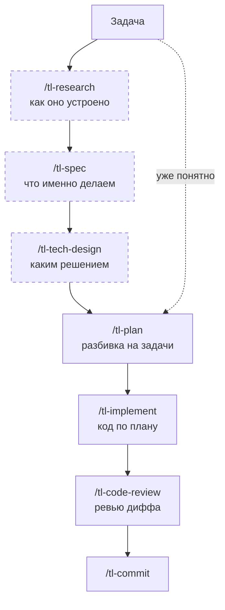

# Skills

> Этот файл сгенерирован автоматически. Не редактируйте вручную — он перезаписывается при `init` и `update`.

`tl-ai-kit` устанавливает не просто набор файлов, а готовую библиотеку skills и команд для типового AI-driven workflow: исследование → спека → план → реализация → ревью → commit. Этот документ показывает, какие skills входят в библиотеку, когда их использовать и как они связаны между собой.

## С чего начать

Основная цепочка — от задачи до коммита. Пунктиром отмечены опциональные шаги: если задача уже понятна, идёшь сразу к `/tl-plan`.



| Что нужно | Команда |
|---|---|
| Пройти цикл целиком одной цепочкой, с сохранением состояния и resume | `/tl-workflow` |
| Впервые попробовать кит на маленькой реальной задаче | `/tl-kit-onboard` |
| Задача понятна — сразу разбить на задачи | `/tl-plan <описание>` |
| Непонятно, как устроено — сначала разобраться | `/tl-research <тема>` |
| Непонятно, что именно нужно сделать — собрать требования | `/tl-spec <тема>` |
| Есть несколько решений — выбрать одно и обосновать | `/tl-tech-design <тема>` |
| План готов — выполнить его | `/tl-implement` |
| Проверить, что получилось, перед коммитом | `/tl-code-review` |
| Оформить результат | `/tl-commit`, затем `/tl-merge-request` |
| Закрыть замечания ревьюера в открытом MR/PR | `/tl-fix-merge-request` |

**Артефакт каждого шага передаётся дальше флагом**, иначе следующий шаг переспросит то же самое: спека уходит как `--spec <path>` в `/tl-tech-design` и `/tl-plan`, design review — как `--tech-design <path>` в `/tl-plan`, план — файлом (`/tl-implement @docs/plans/<файл>.md`). Лежат артефакты по типам: `docs/research/`, `docs/specs/`, `docs/tech-designs/`, `docs/plans/`, а состояние цепочки `/tl-workflow` — в `docs/workflows/<branch>.md`.

Дальше — как убрать лишние skills из листинга, а затем подробное описание каждого skill: когда вызывать, что он делает и чем заканчивается.

## Если скиллов слишком много

Агент держит перечень всех установленных skills — «имя + description» — прямо в системном промпте, и у этого перечня есть бюджет. Когда перечень в бюджет не влезает, он урезается **молча**, без ошибки и предупреждения:

- Claude Code выбрасывает description, начиная с самых редко вызываемых skills. Имя в списке остаётся, но без описания модель перестаёт выбирать такой skill сама — он работает только по явному `/имя`.
- Codex в той же ситуации может опустить skill целиком.

Размер бюджета — доля окна модели: у Claude Code это настройка `skillListingBudgetFraction` со значением по умолчанию `0.01` — 1% окна, то есть ровно 8000 символов на окне 200k, — плюс отдельный потолок `skillListingMaxDescChars` в 1536 символов на один скилл; у Codex — 2% окна, а когда размер окна неизвестен, те же 8000 символов. Одна запись стоит не только описания: `- имя: описание` — это ещё 4 символа сверху и перевод строки между записями. Собственные встроенные skills Claude Code от урезания защищены и берут свою долю первыми, так что киту в реальном проекте достаётся меньше 8000, а не больше.

Скиллы, помеченные как «только вручную» (`disable-model-invocation: true` — это скиллы Jira и Confluence, `tl-feedback`, `tl-research` и `tl-repo-agent-readiness`), Claude Code в листинг вообще не выводит: место они там не занимают, но и сама модель их не выберет — только явное `/имя`. Codex и OpenCode такого поля не знают и продолжают их перечислять.

Отсюда практический вывод: **лишний установленный skill не бесплатен**. `tl-text-*` в проекте без русских текстов, `tl-mcp-builder` там, где никто не пишет MCP, — они не просто не нужны, они вытесняют из листинга те skills, которыми ты пользуешься каждый день. Убирать их стоит до того, как «перестал срабатывать `/tl-plan`» превратится в загадку.

**Путь 1 — временно свернуть через `skillOverrides`.**

Настройка харнесса, которая не трогает ни `SKILL.md`, ни установку: скилл остаётся на диске, меняется только его видимость. В Claude Code это ключ `skillOverrides` в `settings.json` — проектном `.claude/settings.json`, личном `.claude/settings.local.json` (не коммитится) или глобальном `~/.claude/settings.json`:

```json
{
  "skillOverrides": {
    "tl-jira-import": "off",
    "tl-confluence-writer": "user-invocable-only",
    "tl-skill-creator": "name-only"
  }
}
```

| Значение | Что происходит |
|---|---|
| `on` | обычное поведение (значение по умолчанию, писать его не нужно) |
| `name-only` | в листинге остаётся только имя, description скрыт — экономит бюджет, но агент почти перестаёт выбирать skill сам |
| `user-invocable-only` | агент skill не видит, ты вызываешь его вручную через `/имя` |
| `off` | skill скрыт и от агента, и из меню `/` |

Это обратимо: убрал строку из `skillOverrides` — skill вернулся. Изменения подхватываются при старте сессии агента, так что после правки настроек сессию нужно перезапустить.

**Путь 2 — убрать совсем: отказ в мастере установки или `uninstall`.**

- `npx tl-ai-kit update` — в интерактивном выборе снимаешь галочки с ненужных skills. Выбор запоминается в `.tl-ai-kit/config.json`, следующий `update` отказ не отменяет.
- `npx tl-ai-kit init` — то же самое при первой установке: ставь только то, чем будешь пользоваться.
- `npx tl-ai-kit uninstall` — снимает всё, что поставил кит.

**Что не работает — удалять папки руками.**

`.claude/skills/<имя>` и `.agents/skills/<имя>` — это **вывод CLI**, а не источник. Skill числится установленным в `.tl-ai-kit/config.json`, поэтому следующий `npx tl-ai-kit update` восстановит удалённую папку и вернёт skill в листинг. Штатных путей ровно два: свернуть через `skillOverrides` или снять компонент через `update` / `uninstall`.

### `/tl-kit-onboard [задача или область]`
Используй, если хочешь впервые пройти рабочий цикл `tl-ai-kit` на маленькой реальной задаче в репозитории.

```text
/tl-kit-onboard
/tl-kit-onboard разобраться с TODO в модуле отчётов
```

- проверяет установку `tl-ai-kit`, проектный контекст и наличие инструкций по MCP-секретам, не читая и не объявляя проверенными сами значения
- если передан ключ или URL Jira, предлагает загрузить title и description через `/tl-jira-reader`; без reader продолжает по вставленной вручную постановке
- выбирает минимальный маршрут: сразу `/tl-plan`, либо сначала `/tl-research`, `/tl-spec` и/или `/tl-tech-design`, только когда они действительно нужны
- проводит через `/tl-plan` → `/tl-implement` → `/tl-code-review`, не дублируя внутреннюю работу этих skills; для первого прохода рекомендует `inline + interactive + Classic + commit=none`
- считает задачу пройденной после успешной верификации; commit остаётся отдельным явным выбором, а readiness-аудит — необязательным follow-up
- после учебного прохода показывает `/tl-workflow` для обычной цепочки с сохранённым состоянием, resume и общими mode/autonomy
- подходит для первого запуска и обучения команды на живом коде

## Основные workflow skills

Это ядро повседневной разработки с AI-агентом.

### `/tl-research <тема или задача>`
Используй, когда задача еще не до конца понятна и нужно сначала исследовать контекст.

```text
/tl-research Добавить аутентификацию через OAuth
/tl-research Почему текущий модуль уведомлений стал слишком сложным
```

- собирает вводные, ограничения, риски и варианты реализации
- помогает разобраться в проблеме до составления плана
- лучше всего подходит для нечетких требований и задач с несколькими подходами
- вызывается только вручную: агент сам этот режим не включает
- диаграммы рисует в mermaid, а не ASCII-артом — заметку потом читает `/tl-tech-design`, у которого mermaid обязателен
- когда исследование готово, переходи к `/tl-spec` (если требования ещё нечёткие), затем к `/tl-tech-design` (если задача тянет на design review) или сразу к `/tl-plan`
- код не пишет и не правит — но собственную заметку в `docs/research/` пишет всегда, это его результат, а не «нарушение read-only»
- **шагом цепочки `/tl-workflow`** ведёт себя иначе, чем вручную: не гоняет исследование бесконечно (бюджет вопросов по `autonomy`, в `full` — ноль вопросов), сохраняет заметку в `docs/research/<дата>-<slug>.md` без спроса и возвращает результат оркестратору. Не отвечает «сначала выйди из режима исследования» — переход к следующему шагу делает цепочка

### `/tl-spec [--update <path>] [--slug <slug>] <тема>`
Собирает требования (что именно нужно сделать) в отдельную спеку. Используй, когда задача понятна по духу, но не по букве: непонятны границы, нет acceptance criteria, неясно, что уже реализовано.

```text
/tl-spec Корректировка проведённых актов
/tl-spec --update @docs/specs/2026-05-12-correction-saga.md
/tl-spec --slug correction-saga Корректировка проведённых актов
```

- сохраняет документ в `docs/specs/<YYYY-MM-DD>-<slug>.md` с YAML frontmatter (`slug`, `status`, `created`, `updated`, `sources`, `tags`, `superseded_by`)
- нумерует требования стабильными id `REQ-NN`: на них ссылаются downstream-скиллы, поэтому id никогда не перенумеровываются — новые требования только дописываются
- задаёт уточняющие вопросы, пока остаются блокирующие неизвестные; пока они есть — `status: clarifying`, когда закончились — `status: ready`
- до того как писать требования, сверяет с кодом сами вводные: всё, что тикет, вики-страница или твой запрос утверждают о текущем поведении системы («сейчас лимит 100», «эндпоинт уже есть»), получает вердикт `подтверждено` / `устарело` / `не найдено` / `противоречит` со ссылкой на файл и строку. Устаревшую посылку скилл не переписывает молча под код — спрашивает, что считать правдой: источник устарел или это и есть баг, ради которого затеяна задача
- по каждому требованию сверяется с текущей реализацией (`нет` / `частично` / `есть` / `конфликт`) со ссылками на конкретные файлы и строки; расхождения складываются в отдельную таблицу
- решения, принятые за тебя («решай сам»), не прячутся в тексте требования, а выносятся отдельными пунктами в `## Допущения`
- рисует одну mermaid-диаграмму, но только когда она правда нужна: `## Жизненный цикл` (`stateDiagram-v2`), если минимум два требования описывают переходы между статусами одной сущности, или `## Основной сценарий`, если сквозной сценарий идёт через три и больше участников и порядок шагов сам по себе является требованием. На плоском списке требований диаграммы не будет, какого бы размера ни была спека. Каждый переход и шаг подписан своим `REQ-NN`: если на схеме появилось поведение без требования — это дырка в требованиях, и скилл заводит `REQ` или `- [ ] open:`, а не дорисовывает стрелку. Архитектурных схем здесь не бывает — это `/tl-tech-design`
- в конце проходит по остатку: на каждый открытый вопрос, каждый `конфликт` и каждое расхождение вводных с кодом предлагает 2–3 конкретных решения с рекомендацией («поменять код под требование» / «переписать требование под код» / «вынести в Non-goals») и спрашивает один раз, что берём. Что не закрыли — остаётся в документе строкой `- [ ] open: … — предлагаю: …; нужно решение: <кто>`, то есть с готовым вариантом, а не голым вопросом. То, от чего ты уже отказался отвечать, повторно не спрашивается
- дальше: `/tl-tech-design --spec <path>` (выбрать решение) или `/tl-plan --spec <path>` (разбить на задачи)
- если требования уже однозначны и умещаются в одну фразу — шаг пропускается
- до назначения `REQ-NN` отделяет запрошенный результат от соседних возможностей, которых пользователь не просил: последние становятся Non-goals или вопросами, а не скрыто раздувают объём задачи

### `/tl-tech-design [--update <path>] [--slug <slug>] [--spec <path>] <тема>`
Создаёт компактный документ технической проработки фичи (design review). Используй, когда задача тянет на проработку: стори, требующая design review; сложная инфраструктурная или тех-долговая инициатива; saga / распределённые транзакции; новые публичные API.

```text
/tl-tech-design Корректировка актов: распределённая транзакция через Saga
/tl-tech-design --update @docs/tech-designs/2026-05-12-correction-saga/tech-design.md
/tl-tech-design --slug billing-deferral Перенос даты выставления реестров
/tl-tech-design --spec @docs/specs/2026-05-12-correction-saga.md Корректировка актов
```

- сохраняет документ в `docs/tech-designs/<YYYY-MM-DD>-<slug>/tech-design.md` (YAML frontmatter с `status` / `slug` / `chosen_variant` / `supersedes` / `superseded_by`)
- размер документа масштабируется профилями: S — мини-DR на страницу, M — стандарт (по умолчанию), L — крупная инициатива; скилл рекомендует профиль, ты подтверждаешь
- документ устроен как предложение, а не как опросник: `## Решение` вверху и уже до встречи содержит суть решения (2–4 предложения, читается отдельно от вариантов), целевую mermaid-схему «как будет» (обязательна в M/L), «что принимаем как плату» и «что нужно от ревью» — ревьюеру не нужно собирать концепцию из вариантов
- ниже — минимум 2 варианта с anchor-ID и таблицей сравнения; диаграмма в варианте появляется только там, где он структурно расходится с целевой схемой (в L — у каждого)
- существующий код, стандартная возможность платформы или уже установленная библиотека рассматриваются как полноценный вариант, когда реально закрывают цели; в сравнении видны новые внешние библиотеки, сервисы, настройки и компоненты, которые придётся поддерживать
- открытые вопросы сначала решаются с тобой прямо в диалоге; в документ попадают только вопросы уровня решения, каждый — с предложенным дефолтом («предлагаю: …») и лимитом по профилю, остальное уходит допущениями в `## Сквозные аспекты`
- перед выдачей документа проходит по тому, что осталось открытым: каждый вопрос переформулируется как выбор («ретраим 3 раза с backoff или отдаём ошибку сразу», а не «что делать с ретраями»), дефолт объявляется fallback'ом — если на встрече до вопроса не дойдут, едем по нему, — и у каждого появляется ответственный. Вопросы, которым встреча не нужна, предлагается закрыть сразу; те, что ты уже отправил на встречу, второй раз не спрашиваются
- порядок секций: решение → варианты → открытые вопросы → сквозные аспекты, где сквозные аспекты помечены как информационные (без N/A-шума) — это приложение с деталями, а не повестка ревью
- в update-режиме (`--update`) фиксирует выбранный вариант (`chosen_variant`), переводит документ в `status: decided`, заполняет `## Решение` (выбор, причина, участники, hints для плана; суть и целевая схема сохраняются, при смене варианта схема перерисовывается) и rollout/метрики (в S/M — строками в `## Сквозные аспекты`, в L — отдельной секцией `## Rollout & метрики`); старые документы в прежних форматах продолжают работать
- естественный следующий шаг после update — `/tl-plan --tech-design <path>`: план сохраняется обычным образом в `docs/plans/`, в шапке появляются строки `Tech design:` и `Chosen variant:`
- с флагом `--spec <path>` засевает проблему и Goals & Non-Goals из уже собранной спеки и не переспрашивает то, что в ней уже есть; путь спеки попадает во frontmatter (`spec:`) и в маркер `Requirements:` секции `## Проблема`
- для мелких задач design review избыточен — пропусти этот шаг и сразу переходи к `/tl-plan`

### `/tl-plan [--refine [@план]] [--branch [name] | --no-branch] [--spec <path>] [--tech-design <path>] <описание задачи>`
Строит план реализации для фичи, улучшения или заметной технической задачи — и он же дорабатывает уже созданный план в режиме `--refine`.

```text
/tl-plan Добавить аутентификацию через OAuth
/tl-plan --no-branch Удалить устаревший конфиг секций
/tl-plan --branch Добавить аутентификацию через OAuth
/tl-plan --tech-design @docs/tech-designs/2026-05-12-correction-saga/tech-design.md "Корректировка актов"
/tl-plan --spec @docs/specs/2026-05-12-correction-saga.md "Корректировка актов"
/tl-plan --refine
/tl-plan --refine @docs/plans/2026-04-29-feature-oauth.md добавь покрытие тестами
```

- превращает идею в последовательность задач
- сохраняет артефакты планирования в `docs/plans/*.md`
- единый flow планирования; создание git-ветки — отдельный шаг: `--branch [name]` создаёт ветку, `--no-branch` оставляет на текущей, без флага скилл спрашивает (дефолт по типу описания: feature/fix/refactor → создать, chore/docs/test → не создавать). Шагом цепочки `/tl-workflow` этот вопрос не задаётся — флаг приходит от оркестратора: состояние цепочки лежит в файле по имени ветки, и смена ветки на середине оставила бы его сиротой
- с флагом `--tech-design <path>` скилл читает выбранный вариант DR как контекст и добавляет в шапку плана строки `Tech design:` и `Chosen variant:`. Сам план всё равно сохраняется в `docs/plans/`, поэтому auto-discovery в `/tl-plan --refine` / `/tl-implement` его подхватит как обычно
- с флагом `--spec <path>` читает требования `REQ-NN` из спеки как контекст и добавляет в шапку плана строку `Spec:`; свой цикл уточняющих вопросов при этом не запускает — требования уже согласованы. Флаги `--spec` и `--tech-design` совместимы: спека — это WHAT, DR — HOW
- после изучения реального пути выполнения выбирает первый достаточный вариант: существующее решение → стандартные возможности языка или платформы → уже установленная библиотека → минимальный новый код; новые абстракции, настройки и библиотеки должны быть обоснованы текущим требованием или ограничением проекта
- задает основу для дальнейших `/tl-plan --refine` и `/tl-implement`

**Режим `--refine [@план]`** — второй проход по уже существующему плану, до начала кодинга. Ветку не создаёт и новый файл плана не заводит: правит тот же файл на месте.

- без `@<путь>` берёт самый свежий план из `docs/plans/`; `@<путь>` указывает план явно; `--list` показывает доступные планы и ничего не меняет
- перечитывает код под каждую задачу и классифицирует находки по пяти типам: **пропущенная задача** (миграция, конфиг, индекс, проводка, непокрытый краевой случай, отсутствующие «Тесты»), **размытое описание** (нет путей и конкретных действий, непроверяемые критерии приёмки), **кривая зависимость** (A зависит от B, но стоит раньше; или две задачи зря выстроены в цепочку), **лишняя работа или решение** (код уже есть, задачи дублируются либо новая библиотека, абстракция, настройка или заготовка не нужна при достаточной существующей альтернативе) и **неверный объём** (слишком крупная — разбить, слишком мелкая — слить, вне фичи — выкинуть)
- текст после флага — дополнительная линза поверх этих пяти, а не замена им
- сначала показывает отчёт, и только после твоего ответа применяет правки: «Да, все» / «Дай выбрать» / «Нет, оставить план как есть». Шагом цепочки `/tl-workflow` на этот гейт отвечает цепочка по своей автономии: `full` — применить всё и перечислить применённое, `checkpoint` — придержать отчёт до ближайшей контрольной точки, `interactive` — спросить как обычно
- выполненные `- [x]` задачи не трогает никогда — это запись уже сделанной работы

### `/tl-implement [--check] [--reconfigure] [@план] [номер | диапазон | status]`
Выполняет задачи из плана по шагам. Поддерживает режим исполнения, автономию, TDD и три политики коммитов — выбор сохраняется в самом плане.

```text
/tl-implement
/tl-implement @docs/plans/2026-04-29-feature-oauth.md
/tl-implement @docs/plans/2026-04-29-feature-oauth.md 3
/tl-implement 2-4
/tl-implement выполни таски 2-4
/tl-implement --reconfigure
/tl-implement status
/tl-implement --check
/tl-implement --list
```

- идет по плану и отмечает прогресс: `- [x]` появляется **только** после того, как проверка самой задачи (её секция «Тесты») прошла зелёной — чекбокс это подтверждение проверки, а не подтверждение усилий
- красная проверка не сразу блокер: до 5 попыток минимального исправления по фактическому тексту ошибки, потом стоп и вопрос. Ослаблять или переписывать саму проверку, чтобы она позеленела, запрещено
- критерий, который по природе суждение (читаемость API, корректность сопоставления), уходит независимому проверяющему — субагенту или `/tl-code-review`, — а не оценивается тем же агентом, который писал код
- использует проектный контекст, правила и связанные артефакты
- подходит как для продолжения начатой работы, так и для полного прохождения плана
- перед кодом прослеживает реальный путь вызовов и выбирает первый достаточный вариант; после успешной проверки критериев приёмки, сборки и тестов удаляет лишние изменения, не сокращая валидацию, обработку ошибок, безопасность, доступность интерфейса и обязательные тесты
- без аргументов автодетектит план; `@<путь>` указывает план явно, число — стартовую задачу, `N-M` — диапазон, NL-фразы вроде «выполни таски 2-4» / «c N до конца» тоже понимаются
- `status` печатает прогресс и ничего не запускает; `--list` показывает доступные планы; `--check` гоняет только финальный гейт полноты и тоже ничего не меняет

**Гейт полноты в конце.** Когда все задачи отмечены, скилл не верит чекбоксам, а идёт по каждой задаче в код и ищет то, что она обещала: `✅ Выполнено` / `⚠️ Частично` / `❌ Не найдено` / `⏭️ Пропущено`. `- [x]` сам по себе статус не повышает. Именно этот проход ловит задачу, которая не дала вообще никаких изменений — в диффе её просто не видно. Всё, что не `✅`, возвращает свой чекбокс в `- [ ]`, и план не объявляется завершённым. Если в шапке плана есть строка `Spec:`, дополнительно проверяется обратная связность: каждый `REQ-NN` спеки назван хотя бы одной задачей.

**Режим исполнения, автономия, TDD и политика коммитов.** При первом запуске на плане скилл задает четыре вопроса — режим исполнения, автономия, TDD/Classic, когда предлагать коммит — и сохраняет ответ как однострочный HTML-маркер в шапке плана:

```
<!-- tl-implement: mode=inline autonomy=interactive tdd=false commit=per-task -->
```

- `mode` (где идёт работа): `inline` (основной агент пишет код сам), `subagent-per-task` (на каждую задачу — отдельный субагент), `subagent-per-phase` (субагент на целую фазу, возвращает список выполненных задач)
- `autonomy` (как часто останавливаться спросить): `interactive` (подтверждение почти на каждом шаге, по умолчанию), `checkpoint` (идёт сам, но встаёт на границах фаз и перед необратимым — коммит/пуш/миграция — и ждёт «ок»), `full` (идёт по всему плану сам, стоп только на настоящем блокере; мягкие вопросы решает по дефолту и помечает)
- `tdd`: `false` — сначала код, потом тесты в той же PR (по умолчанию); `true` — сначала падающие тесты, потом реализация до зелёного
- `commit`: `per-task` (после каждой задачи), `per-phase` (только на границе фазы), `none` (внутри сессии не предлагать; финальный `/tl-code-review → /tl-commit` всё равно запустится)

Оси `mode` и `autonomy` независимы — осмысленны все сочетания (например `subagent-per-task` + `full` = «большой план, ушёл на сутки»). `mode` и `autonomy` — общие ключи слоя «режим выполнения», их понимают и другие скиллы.

Дефолт `mode=inline autonomy=interactive tdd=false commit=per-task` повторяет старое поведение `tl-implement` байт-в-байт. Старый маркер без `autonomy` читается как `autonomy=interactive` — перенастройка не нужна.

- `--reconfigure` — удалить маркер и задать четыре вопроса заново
- partial run (`/tl-implement 2-4`, NL-фразы) уважает существующий маркер молча; если маркера ещё нет — задает вопросы один раз на сессию
- для frontend-задач в проектах с tlui / Reactor агент обращается к MCP-серверам `tl_tlui` / `tl_reactor`, чтобы взять готовую директиву или компонент вместо собственной верстки. Подробности — в `.tl-ai-kit/mcp/`.

### `/tl-workflow [--list] [описание цепочки]`
Оркеструет цепочку скиллов как единый сквозной флоу.

```text
/tl-workflow
/tl-workflow research → spec → plan → implement → code-review → commit
/tl-workflow --list
```

- в начале один раз выбираешь: какие скиллы в цепочке и в каком порядке, плюс две оси слоя «режим выполнения» — `mode` и `autonomy`
- доступные шаги: `tl-research`, `tl-spec`, `tl-tech-design`, `tl-plan` (и опциональный `tl-plan --refine`), `tl-implement`, `tl-code-review`, `tl-commit`, `tl-fix-merge-request`. `tl-spec` (требования с `REQ-NN`) и `tl-tech-design` (варианты решения) отвечают на разные вопросы и берутся по отдельности, а не пакетом
- проверка полноты по плану отдельным шагом не стоит: `/tl-implement` не отчитывается о завершении плана, пока не пройдёт собственный гейт полноты, так что цепочка не сверяет одни и те же чекбоксы дважды
- артефакты прокидываются вперёд: спека уходит в `/tl-plan --spec <path>` и `/tl-tech-design --spec <path>`, design review — в `/tl-plan --tech-design <path>`; поэтому шаг требований не приходится оплачивать дважды
- переход между шагами делает цепочка: если шаг заканчивается своим «Что дальше?» (как `/tl-plan` или `/tl-implement`), оркестратор это не форвардит, а идёт к следующему невыполненному шагу. `tl-research`, `tl-spec` и `tl-tech-design` свой вопрос внутри цепочки вообще пропускают
- `autonomy` (`interactive` / `checkpoint` / `full`) выбирается один раз и прокидывается в каждый шаг — это и даёт сквозной «hands-off» прогон; `mode` (`inline` / `subagent-per-step`) определяет, где идёт шаг
- состояние цепочки лежит в `docs/workflows/<branch>.md`: маркер `<!-- tl-workflow: mode=... autonomy=... -->` + чек-лист шагов. Шаг с документом даёт ссылку на артефакт, шаг без документа (`implement`, `code-review`, `commit`) — строчку с результатом; прогресс отмечает только оркестратор
- продолжается между сессиями: следующий `/tl-workflow` находит файл по ветке и идёт с первого неотмеченного шага
- `autonomy` хранится в одном месте — в маркере цепочки. Единственный шаг, который читает её не из run-контекста, а из файла плана, — `tl-implement`: перед его запуском оркестратор патчит маркер `<!-- tl-implement: ... -->` нужной автономией
- цепочка прокидывает в шаг не только автономию, но и ответы на его собственные гейты — иначе шаг либо встанет, либо агент ответит за тебя:
  - `tl-implement` — в маркер пишутся все четыре ключа. `mode=inline` (а не `subagent-per-step` цепочки: субагент внутри субагента поддерживают не все харнессы) и `commit=none`, если в чек-листе есть отдельный шаг `commit`, иначе цепочка закоммитит дважды — после каждой задачи и ещё раз в конце
  - `tl-plan` — явный флаг ветки и гейт применения правок в `--refine`
  - `tl-commit` — номер задачи (из цепочки или из имени ветки; если его нет — коммит «без задачи», выдумывать нельзя) и решение о push: `commit` в списке необратимых действий, поэтому в `full` цепочка коммитит, но не пушит, пока ты явно не разрешил
- если шаг-скилл не поддерживает `autonomy`, цепочка деградирует к интерактивному поведению на этом шаге и сообщает об этом один раз
- `--list` показывает существующие файлы цепочек и ничего не запускает
- субагенты — опциональная оптимизация; базовый путь (`inline`) работает на любом харнессе

### `/tl-commit [scope]`
Оформляет staged-изменения в осмысленный commit.

```text
/tl-commit
/tl-commit api
```

- анализирует staged diff
- предлагает commit message в стиле Conventional Commits
- необязательный аргумент задаёт scope или короткий контекст для агента
- завершает типовой workflow после `/tl-code-review`
- шагом цепочки `/tl-workflow` гейты решает автономия: `interactive` спрашивает как обычно, `checkpoint` делает коммит контрольной точкой, `full` коммитит сам. Номер задачи при этом не выдумывается (нет значения от цепочки и в имени ветки — коммит без задачи), а push в `full` по умолчанию не выполняется: локальный коммит легко откатить, отправленный — нет

---

## Skills для проектного контекста и документации

Эти skills помогают описывать проект, поддерживать контекст и не терять знания между сессиями.

### `/tl-docs [init | update | audit | add] [--dry-run] [--headless]`

Единый скилл документации по стандарту TL AI-native repo.

```text
/tl-docs
/tl-docs init
/tl-docs update --dry-run
/tl-docs audit
/tl-docs update --headless
/tl-docs add зафиксируй решение: ссылки между агрегатами только по Id
```

Без аргументов режим определяется автоматически по наличию `lastUpdateCommit` в `.tl-ai-kit/config.json`. Явный режим переопределяет авто-детект.

**Режимы:**

- **init** (автоматически — если запускаешь впервые): создаёт полный layout с нуля
  - `README.md` (лендинг + секция Tech Stack)
  - корневой `AGENTS.md` (skeleton с tl-ai-kit markers)
  - `docs/README.md` (human route map) + `docs/AGENTS.md` (agent navigation)
  - `docs/architecture/` — `overview.md`, `layers.md`, `dependencies.md`, `constraints.md`
  - `docs/development/` — `rules.md` (бывший `RULES.md`), `testing.md`, `review.md`, `migrations.md`, `releases.md`
  - `docs/change-scenarios/` — 10 playbook'ов (new-feature, bugfix, refactor, api-change, config-change, db-migration, dep-upgrade, perf-fix, frontend-change, incident-postmortem)
  - `docs/adr/README.md` — шаблон ADR
  - `docs/glossary.md` — автоматически, если в коде ≥20 CamelCase/UPPER-терминов

- **update** (автоматически — если уже был init): incremental от последнего прогона
  - Читает `git diff <lastUpdateCommit>..HEAD`
  - Обновляет только тронутые управляемые файлы
  - Детектит человеческие правки через content-hash (SHA-256 + нормализация EOL) и делает smart merge; при настоящей коллизии спрашивает пользователя
  - В корневом `AGENTS.md` content-hash считает только текст вне управляемых блоков: `tl-ai-kit` маркеры и внешние gear-блоки (`agent-docs` / `user-notes`) игнорируются и не считаются человеческими правками, а их содержимое сохраняется как есть
  - Умеет мигрировать legacy `docs/DESCRIPTION.md` / `docs/ARCHITECTURE.md` / `docs/RULES.md` на первом update

- **audit** (явный флаг): read-only отчёт о stale-файлах, конфликтах и битых ссылках — ничего не пишет.
- **add** (только явно, никогда не авто): точечно вписывает одно конкретное знание (решение, правило, инвариант) в нужный файл на правильной «высоте». В отличие от **update** (подтягивает docs под изменения кода по `git diff`), **add** — это ручная фиксация факта, который ты хочешь сохранить прямо сейчас. На недокументируемый ввод (разовая деталь, то что выводится из кода, внешнее знание по ссылке) даёт пушбэк и подсказывает куда это лучше деть (commit / комментарий в коде / `/tl-reference`). Не двигает `lastUpdateCommit` — обновляет только hash тронутых файлов.
- **--dry-run** и **--headless** модификаторы. В headless никаких вопросов; коллизии правок → stderr + exit code 2; недокументируемый ввод в `add` → stderr `add: not doc-worthy: …` + exit code 3.

Любая запись (init / update / add) проходит свод doc-практик: правильная «высота» (durable-знание, а не зеркало кода), replace-over-append (переписываем секцию, а не дописываем), single source of truth (без дублей с кодом/README).

Состояние скилла хранится в `.tl-ai-kit/config.json` → `skillState['tl-docs']` (lastUpdateCommit, lastUpdateAt, managedFiles с hash по каждому файлу).

### `/tl-local-agents-md [candidates | validate <путь>]`
Помогает с локальными `AGENTS.md` — навигационными файлами для AI-агента, которые лежат не в корне репо, а в сложных директориях (модулях, сервисах, приложениях).

```text
/tl-local-agents-md candidates
/tl-local-agents-md validate src/payments/AGENTS.md
```

Два режима:

- **`candidates`** — сканирует репозиторий и предлагает приоритизированный список директорий-кандидатов на локальный `AGENTS.md`. Сигналы: размер папки, число зон ответственности под одной крышей, наличие нескольких внешних интеграций рядом, устаревающие зоны, частота изменений за год. Не создаёт файлы — выводит таблицу `путь | приоритет | сигналы | уже есть AGENTS.md | короткая причина`.
- **`validate <путь>`** — прогоняет готовый локальный `AGENTS.md` по чеклисту: не дублирует ли корневой `AGENTS.md`, объём 30–120 строк, все относительные ссылки существуют, устаревающие зоны помечены явно, нет смешения синонимов, есть навигационные разделы, узкие бизнес-кейсы не в центре. Файл не правит — отдаёт отчёт по severity (`must` / `should` / `nit`) с точными строками и предложениями.

Что скилл намеренно НЕ делает: не генерирует тело локального `AGENTS.md` автономно, не правит корневой `AGENTS.md` и его alias-файлы, не запускает синхронизацию (для этого есть `/tl-sync-agents`).

### `/tl-compound [light | full] [фокус]`

```text
/tl-compound
/tl-compound light
/tl-compound full правила тестирования
```

- анализирует текущую рабочую сессию и ищет, каких профилактических правил не хватало агенту
- превращает свежие выводы в минимальные точечные улучшения для `docs/development/rules.md`, `docs/skill-context/<skill>/SKILL.md`, корневого `AGENTS.md`, `docs/AGENTS.md` и `docs/architecture/*`
- для важного временного упрощения фиксирует хотя бы предел применимости и наблюдаемый повод вернуться к решению; следующий шаг развития добавляет, только если он уже понятен из сессии
- `light` — 1–3 самых ценных правки; `full` (по умолчанию) — глубокий проход; необязательный фокус сужает зону внимания
- сначала показывает предложения, а правки вносит только после подтверждения пользователя

### `/tl-reference <url|путь> [--name <имя>] [--update]`

```text
/tl-reference https://example.com/docs --name my-api
/tl-reference docs/spec.md
/tl-reference https://example.com/docs --update
```

- собирает локальную базу знаний по внешним источникам в `docs/references/`
- нужен, когда проект опирается на внешние API, библиотеки или спецификации
- `--name` задаёт имя файла справочника; `--update` обновляет существующий справочник свежими данными из источника

### `/tl-visualize [<файл> | <вопрос>] [--out <path>]`
Собирает из текстового артефакта или из данных одну самодостаточную HTML-страницу. Используй, когда информация вроде вся есть, но глазами её не охватить: план на 24 задачи, спека на 30 требований, дамп JSON.

```text
/tl-visualize @docs/plans/feature-auth.md
/tl-visualize @docs/specs/2026-05-12-correction-saga.md
/tl-visualize покажи, в каких модулях больше всего изменений за последний месяц
```

- **страница начинается с вводки:** одна-три фразы о том, что за документ и зачем эта страница — чтобы её можно было переслать коллеге, который исходник не открывал. «О чём» берётся из самого документа (цель плана, `## Scope` спеки, `## Проблема` tech-design), «зачем» — из твоего запроса; выдуманных мотивов там не будет
- блоки, из которых собирается страница: KPI-плитки (со спарклайном), прогресс (с засечкой цели), таблицы сравнения (сортировка, фильтр, раскрытие строки), матрица «строка × колонка» и теплокарта, граф зависимостей, timeline с вехами и отметкой «сегодня», столбчатый (в том числе составной), линейный график, кольцевая диаграмма, точечная диаграмма с квадрантами, доска по состояниям, карточки, дерево, цепочка шагов, блок кода, callout
- **клик по задаче раскрывает задачу целиком:** у строки таблицы есть `detail` — контекст, что сделать, файлы, acceptance criteria, тесты. Полный текст остаётся на странице, а не «смотри исходник»: он ищется фильтром даже свёрнутым, едет вместе со своей строкой при сортировке и раскрывается на печати. Плюс кнопка «Развернуть все»
- есть рецепты под артефакты кита: план → прогресс по чекбоксам + граф зависимостей из «Зависит от» + таблица всех задач с раскрытием; спека → матрица `REQ-NN` × текущее состояние с конфликтами наверху; tech-design → сравнение вариантов и открытые вопросы к встрече; ADR → статусы и цепочка замен; состояние `tl-workflow` → цепочка шагов; research — по тому, что реально есть в файле
- **документ не по формату кита — нормальный случай:** чужой план из Jira, спека в своей структуре, просто markdown. Скилл читает то, что реально есть (frontmatter, заголовки, чекбоксы, таблицы, id вида `ABC-123`), и строит страницу по документу, а не по рецепту; чего в файле нет — статусов, зависимостей, дат — прямо пишет на странице, вместо пустого графа и прогресса ни от чего
- **работает не только по одному файлу:** целая папка (`docs/plans/`, `docs/adr/`) собирается в одну страницу-портфель, а план со ссылкой `Spec:` — в сверку «требование ↔ задачи», где видно требование, под которое никто не завёл задачу
- **полный список всегда на странице, но под катом:** любой блок умеет `collapsible`, поэтому по плану всегда идёт таблица всех задач — свёрнутая, если всё сделано, и развёрнутая по незакрытым задачам, если работа в процессе. Свёрнутый блок стоит одну строку, ищется через Ctrl+F и раскрывается на печати
- **схемы не ужимаются:** ориентация графа выбирается автоматически (длинная цепочка задач — сверху вниз и влезает в колонку страницы, широкий веер — слева направо), а если схема всё равно шире экрана, она прокручивается, а не масштабируется в нечитаемый мелкий шрифт
- **если нужного блока нет — рисуется свой:** блок `svg` даёт рамку, прокрутку и токены темы, `raw` — свою вёрстку, `css` / `js` в описании страницы — свои стили и поведение. Набор блоков это пол, а не потолок; единственное, что не гнётся — запрет на сеть
- **страница тёмная:** одна палитра, без переключателя; на печати токены сами переключаются на бумажные, чтобы распечатка не была чёрным листом
- **zero-dependency:** графики рисуются inline SVG, стили инлайнятся; ни CDN, ни шрифтов из сети — страница открывается офлайн двойным кликом и не ломается за корпоративным прокси
- результат — расходник: `.tl-ai-kit/visualizations/<slug>.html`, папка сама попадает в `.tl-ai-kit/.gitignore`
- исходный документ не трогает: если в плане или спеке что-то не так, скилл скажет об этом, но править не будет
- ничего не выдумывает: оценок, дат и процентов, которых нет в источнике, на странице не появится, а то, что не влезло (top-N, обрезанный граф), подписано прямо на странице
- посмотреть, из чего вообще можно собирать: `node <skill-dir>/scripts/render.mjs --gallery -o .tl-ai-kit/visualizations/gallery.html` — витрина всех блоков с примерами и JSON под каждым
- не для дизайна продуктового интерфейса (это `tl-frontend-design`) и не замена mermaid-схем внутри markdown-артефактов — HTML-страница рядом с ними производная, а не источник правды

### `docs/skill-context/<skill>/SKILL.md`
- локальный слой правил для конкретного skill внутри текущего проекта
- используется, когда нужно переопределить или дополнить поведение skill без изменения его базового `SKILL.md`
- особенно полезен для `/tl-code-review`, `/tl-plan`, `/tl-implement`, где проект часто требует своих обязательных проверок и формата вывода

Пример: если создать `docs/skill-context/tl-code-review/SKILL.md`, то `/tl-code-review` должен прочитать его и применять как project-specific override. При конфликте правил приоритет у skill-context, а не у общего skill.

---

## Skills для качества

Это набор специализированных skills для инженерных задач по качеству.

### `/tl-repo-agent-readiness [report-path]`

```text
/tl-repo-agent-readiness
/tl-repo-agent-readiness docs/reports/agent-readiness.md
```

- проводит аудит репозитория по фактам из файлов: насколько он готов к автономной работе AI-агента
- оценивает документацию, навигацию по коду, явность контрактов, тесты, локальный запуск, модульность, единый стиль, диагностику, CI и защитные правила для агента
- не запускает команды проекта (`npm test`, сборку, task runners, бинарники репозитория), а оценивает готовность по файлам и конфигам
- не читает секреты и файлы с доступами (`.env`, `.npmrc`, ключи, токены, credentials)
- сохраняет полный Markdown-отчёт в репозиторий; если путь не указан, использует `tl-repo-agent-readiness-report.md`

### `/tl-code-review [PR номер или URL]`

```text
/tl-code-review
/tl-code-review 42
/tl-code-review https://gitlab.example.lan/group/repo/-/merge_requests/42
```

- канонический ревью диффа кита: читает ханки, а не файлы целиком, и даёт замечание только там, где может назвать конкретный `file:line` и конкретный сценарий поломки: рантайм-ошибки → достижимость из недоверенного ввода → нарушение явных правил проекта. Без стилистики и «а можно вынести в функцию». Отдельно ловит оставленные `TODO` / `FIXME` / отладочные логи в добавленных строках. Дальше — build, тесты и lint по командам из документации проекта; итог `🟢` / `🟡` / `🔴` (`--no-checks` их пропускает)
- без аргумента берёт staged diff, а если staged пуст — unstaged
- с номером или URL PR/MR берёт дифф через MCP репозитория, если он подключён; иначе через CLI платформы (`glab mr diff <id>`, `gh pr diff <id>`); иначе локально — `git fetch origin <branch>` и сравнение с дефолтной веткой
- полноту по плану не проверяет: это делает гейт `/tl-implement` в конце реализации. Здесь — только дефекты в диффе
- находки не чинит, а передаёт дальше списком `file:line`
- уважает `docs/skill-context/tl-code-review/SKILL.md` и ничего не пишет в `docs/*`

---

## Встроенные общие skills

Помимо TL-specific workflow, в библиотеку входят и более общие skills, которые можно ставить в проект как отдельные строительные блоки:

- `tl-frontend-design` - production-grade frontend и UI с акцентом на качество дизайна
- `tl-doc-coauthoring` - совместная работа над документацией, спецификациями и decision docs
- `tl-changelog-generator` - сборка changelog из истории git
- `tl-mcp-builder` - создание MCP-серверов
- `tl-playwright` - браузерная автоматизация и E2E-сценарии
- `tl-text-plain` - упрощение и нормализация текстов
- `tl-skill-creator` - создание, улучшение и тестирование skills; сравнивает версии в изолированных тестовых окружениях и сначала проверяет полноту, корректность и безопасность, а уже потом размер ответа, расход контекста и время
- `tl-repo-agent-readiness` - аудит готовности репозитория к автономной работе AI-агента
- `tl-kit-onboard` - обучающий маршрутизатор по первому циклу tl-ai-kit: постановка напрямую или из Jira, минимально нужные research/spec/design, план, реализация и независимая проверка
- `tl-text-review` - проверка текстов на ошибки, дубли и противоречия
- `tl-sync-agent-file-access` - синхронизация постоянной политики доступа AI-агентов из подробного человеческого источника истины в agent-specific технические проекции по явно заданной проектом adapter map; маски обычного массового поиска по умолчанию записываются в корневой `.ignore`; request-scoped command rules для filesystem sandbox создаются только по конкретному запросу и не записываются в общую документацию
- `tl-sync-agents` - синхронизация AGENTS.md и CLAUDE.md
- `tl-sync-skills` - синхронизация скиллов между `.agents/skills/` и `.claude/skills/`

Эти skills хорошо дополняют основной workflow и закрывают частые инженерные задачи вокруг разработки.
